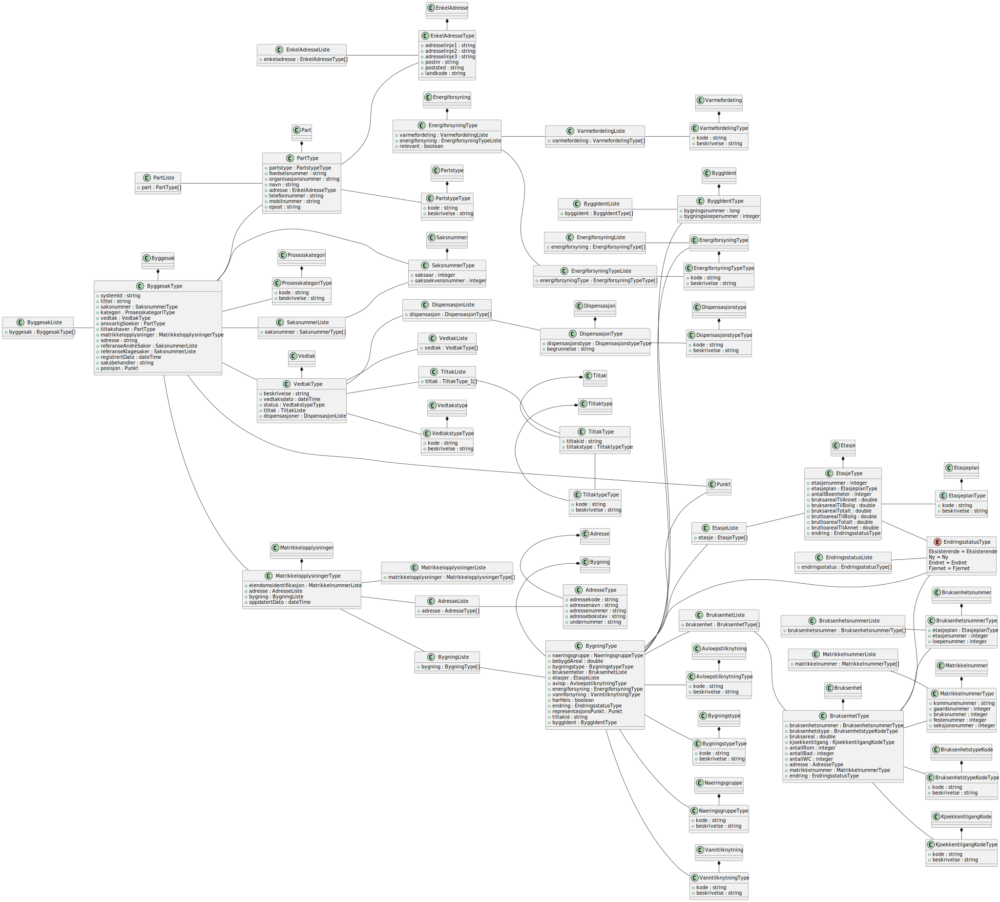

## Grunnlag

Dette klassediagrammet er generert til PlantUML fra xsd-filen, og manuelt lagt på relasjoner. 
Det viser hvordan xsd-filen `no.ks.fiks.matrikkelfoering.grunnlag.xsd` og C# klassene generert fra xsd-filen ser ut.

