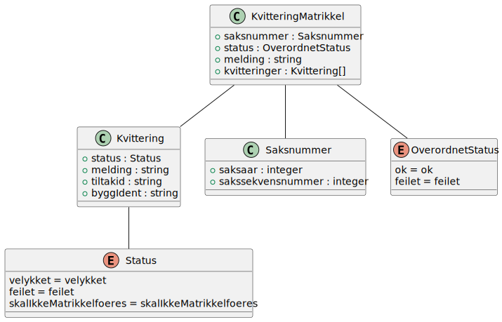

# Kvittering

Dette klassediagrammet er generert til PlantUML fra xsd-filen, og manuelt lagt på relasjoner.
Det viser hvordan xsd-filen `no.ks.fiks.matrikkelfoering.kvittering.xsd` og C# klassene generert fra xsd-filen ser ut.

## Forklaringer

### KvitteringMatrikkel
#### Status (OverordnetStatus) 
Man skal sette `status` til **feilet** hvis 1 eller flere Kvittering objekter har `status` **feilet**. 
Status verdien **skalIkkeMatrikkelfoeres** skal ikke føre til status **feilet**, da er OverordnetStauts **ok**.

### Kvittering
#### TiltakId
Denne skal være unik. I tilfeller hvor grunnlag-meldingen som kom inn ikke hadde noen bygninger, men man leverer tilbake i kvittering en bygning, skal tiltakid settes til noe unikt. 

